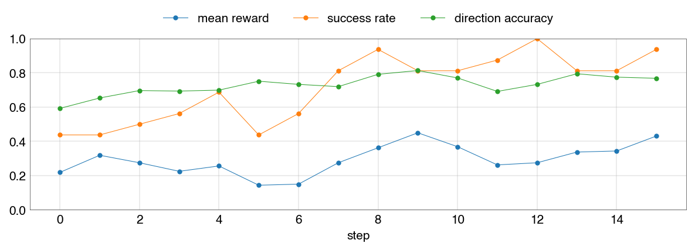

# GRPO - Group Relative Policy Optimisation

Post-training a small language model on a number guessing game with [GRPO](https://arxiv.org/pdf/2402.03300).



## Task

- The model is given a `[min, max]` number range in the prompt and must guess the hidden number.
- Guesses are made in `<guess>N</guess>` tags.
- The environment responds with `higher` or `lower` after each guess.
- The model can request a hint with `<guess>hint</guess>`, which returns whether the number is even or odd.

**Reward:** The implementation supports two reward types:

- **binary** (default): 1.0 on success (correct guess), 0.0 on failure.
- **dense**: success bonus scaled by guess count: $\max(0.1, 1.0 - 0.1 \cdot (\text{number of guesses} - 1))$ on success, 0.0 on failure.

## GRPO Algorithm

In GRPO, we optimise $\pi_\theta$ **using samples from** $\pi_{\theta_{\text{old}}}$ over a dataset of questions $q \sim P(Q)$. For each question $q$, we sample a group of outputs $\lbrace o_1, o_2, \dots, o_G \rbrace$ from the old policy $\pi_{\theta_{\text{old}}}$, and score each output to attain $\mathbf{r} = \lbrace r_1, \dots, r_G \rbrace$. The loss is aggregated as a _sequence-mean token-mean_ (inner mean over tokens, outer mean over sequences). We maximise the following objective:

$$
J_{GRPO}(\theta) = \mathbb{E}_{q \sim P(Q), \lbrace o_i \rbrace_{i=1}^G \sim \pi_{\theta_{\text{old}}}(\cdot \mid q)} \left[ \frac{1}{G} \sum_{i=1}^G \frac{1}{|o_i|} \sum_{t=1}^{|o_i|} \left\lbrace \mathcal{L}_{i,t}(\theta) - \beta \mathbb{D}_{KL} \left[ \pi_{\theta} \parallel \pi_{ref} \right] \right\rbrace \right]
$$

where

$$
\mathcal{L}_{i,t}(\theta) = \min \left( r_{i,t}(\theta) \hat{A}_{i,t}, \text{clip} \left( r_{i,t}(\theta), 1 - \epsilon, 1 + \epsilon \right) \hat{A}_{i,t} \right)
$$

and

$$
r_{i,t}(\theta) = \frac{\pi_\theta(o_{i,t} \mid q, o_{i,\lt t})}{\pi_{\theta_{\text{old}}}(o_{i,t} \mid q, o_{i,\lt t})}
$$

and

- $\epsilon$ is a clipping hyperparameter controlling the magnitude of updates away from the old policy,
- $\beta$ is a KL penalty coefficient,
- $\pi_{ref}$ is a reference policy, (usually) the initial policy at the start of RL,

and $\hat{A}_{i,t}$ is the advantage of the $t$-th token of the output $o_i$. In the simplest formulation, we set the advantages of all tokens $t$ in an output to be the group-normalised episode reward (outcome supervision):

$$
\hat{A}_{i,t} = \frac{r_i - \text{mean}(\mathbf{r})}{\text{std}(\mathbf{r}) + \varepsilon}
$$

(with $\varepsilon$ for numerical stability when $\text{std}(\mathbf{r}) = 0$).

Lastly, the Kullback-Leibler (KL) Divergence $\mathbb{D}_{KL}$ is estimated via

$$
\frac{\pi_{ref}(o_{i,t} \mid q, o_{i,\lt t})}{\pi_{\theta}(o_{i,t} \mid q, o_{i,\lt t})} - \log\frac{\pi_{ref}(o_{i,t} \mid q, o_{i,\lt t})}{\pi_{\theta}(o_{i,t} \mid q, o_{i,\lt t})} - 1
$$

(equivalent to $\exp(\log p_{ref} - \log p_\theta) - (\log p_{ref} - \log p_\theta) - 1$). This is an unbiased estimator of $D_{KL}(\pi_\theta \parallel \pi_{ref})$ **when the expectation is under $\pi_\theta$**. Here the outer expectation is over samples from $\pi_{\theta_{\text{old}}}$, so the KL estimate is generally **biased** unless an importance-sampling correction is applied (or samples are drawn under $\pi_\theta$).

## Training Script

```bash
uv run train
```

This takes ~90s on an M1 Pro.

## Streamlit App

```bash
uv run app
```
